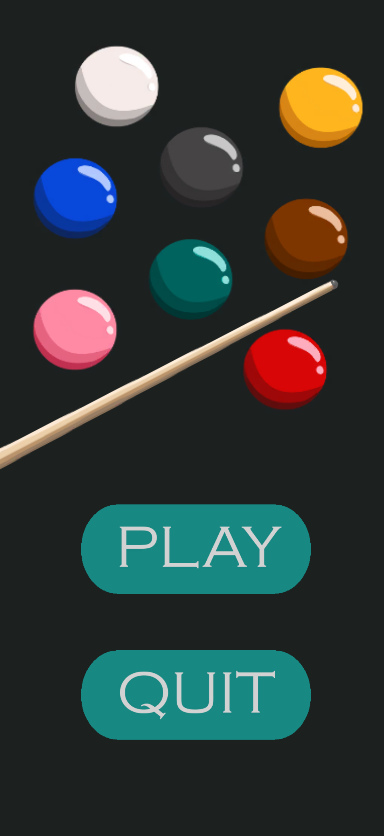
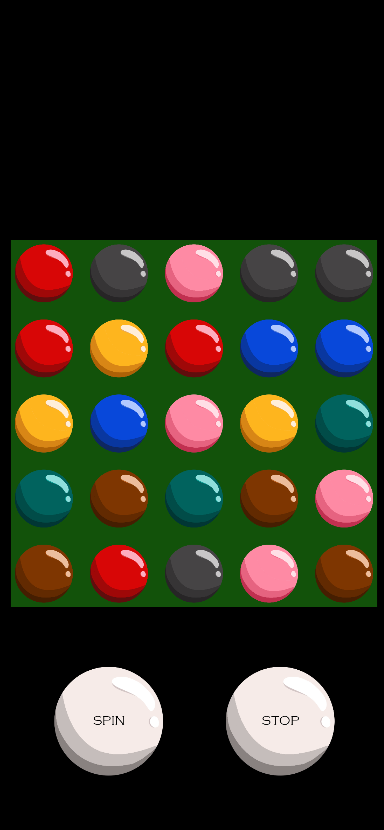
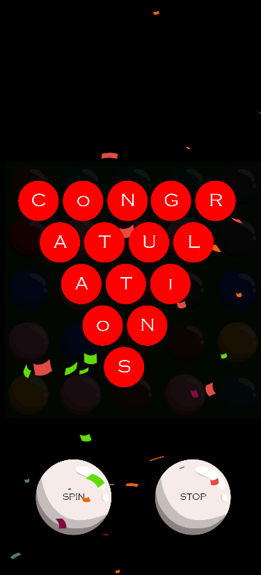

# GrandGames-CaseStudy
It'a 2D 3tilematch Unity game that has slot-like animations for Grand Games game developer case study. 
I've tried a different consept which is a snooker theme. 
All technical and gameplay requirements provided.   

In the video I've tried to show these:  
- When you press the spin button it will start the slot animation. While it's working it can not be pressed again.  
- When you press the stop button the final board placements will be decided. While it's working it can not be pressed again.  
- As long as you don't touch the tiles, you can spin again.
- When you touch a tile on the board, the spin and stop buttons will be unabled.  
- If you match 3 or more tiles on the same row or column, the succession pop-up will appear on the screen.  
- After 2 seconds the scene will be reloaded, and the game will start again.  

P.S: I did not remove the button animations even when the buttons are deactivated because I wanted to show it in the video that i was clicking.  

Initial Menu:  
  

Game Board:   
  

Level-End Pop-Up:  
  
